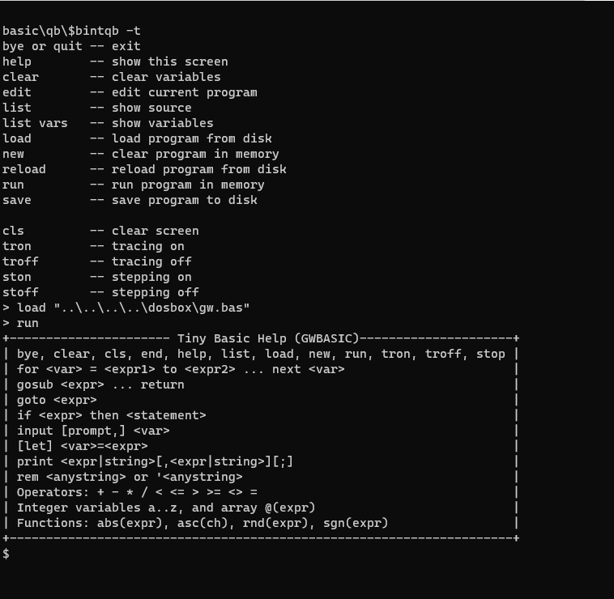
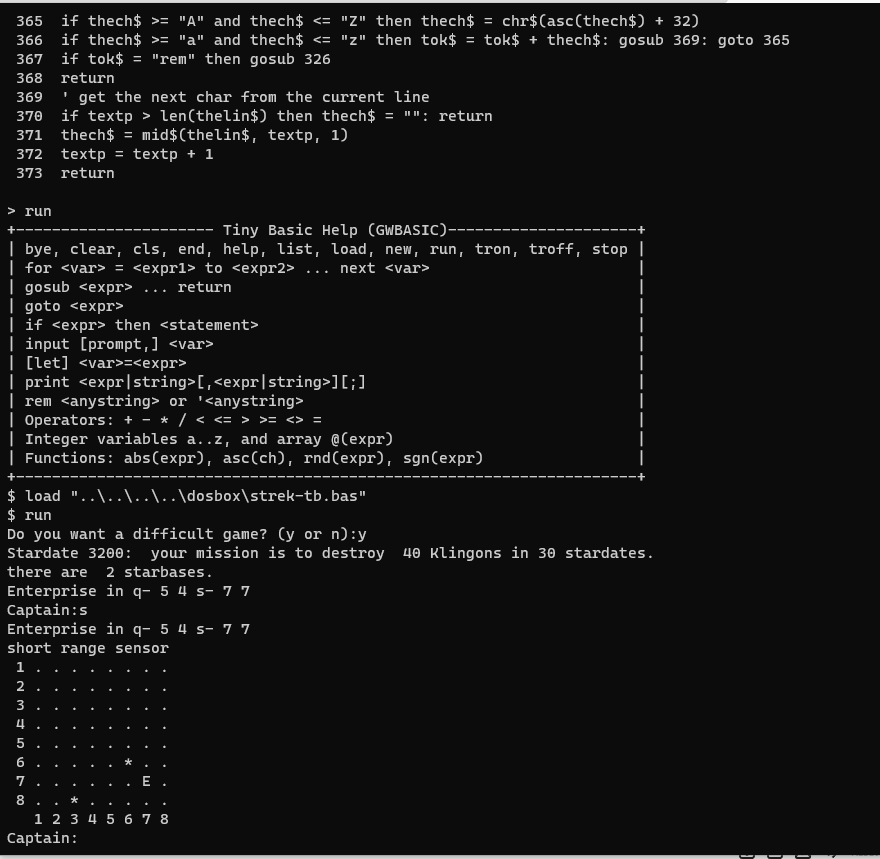

# Basic-Interpreters
QBASIC-like interpreters, implemented in Basic

bintqb.bas is the QB64 version

bintfb.bas is the FreeBasic version

Both interpret a QBASIC subset.

bintqb running a Tiny Basic interpreter, that is itself written in GW-Basic:

Same, and now loading an running Tiny Star Trek into gw, who is being interpreted by bintqb:

